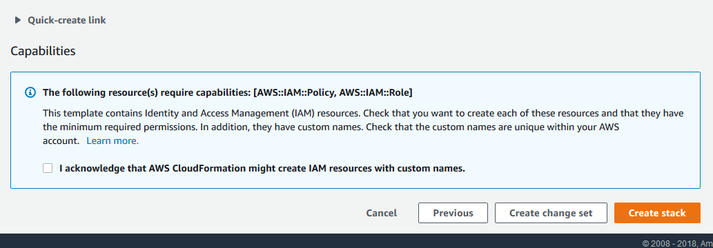

Module 1: Environment Build and Configuration
=============================================

In this first module you will build the environment using a CloudFormation template. As a reminder, make sure you are in a region supported by Amazon Inspector (<https://docs.aws.amazon.com/inspector/latest/userguide/inspector_supported_os_regions.html>); we recommended the *us-east-1* region. You must also have an Amazon EC2 Key Pair in the region. If you do not, you must [create an EC2 Key Pair](<https://docs.aws.amazon.com/AWSEC2/latest/UserGuide/ec2-key-pairs.html#having-ec2-create-your-key-pair>) for the instances to use.

The CloudFormation template takes about 10 minutes to deploy in total; 5 minutes to deploy the infrastructure and an additional 5 minutes for listeners to become active on the instances.

Deploy the CloudFormation template
==================================

Running the CloudFormation script is easy. There are specific outputs at the end of the process to help you test and validate the instances are up and keep track of instances while looking at the Inspector Report.

Before you deploy the CloudFormation template feel free to view it [here](./assets/EnvironmentBuild.json). To deploy the CloudFormation template in the *us-east-1* region and complete steps 1-4 below you can click the following button.

**US East 1 (N. Virginia)** &nbsp; &nbsp; &nbsp; &nbsp;

---

If you choose to use a region different than *us-east-1*, start with step 1.

1.  Make sure you are in a region that supports Amazon Inspector (<https://docs.aws.amazon.com/inspector/latest/userguide/inspector_supported_os_regions.html>)

2.  Go to the AWS CloudFormation console

3.  Click “Create Stack”

    1.  Select “Upload a Template File” and add the JSON file provided [here](./assets/EnvironmentBuild.json).

4.  Click Next

5.  Fill out the screen as follows:

    1.  Stack Name: {Whatever name you will remember}

    2.  Availability Zone 1: Pick any availability zone

    3.  Availability Zone 2: Pick any availability zone except the first one you picked

    4.  LatestLinuxAmiID: Leave as default. This is here to get the latest Amazon Linux 2 AMI. The demo has currently been tested on this.

    5.  PassedKeyName: Select the desired key pair.

	!!! info "PassedKeyName Parameter"
		

		Regardless of whether you used the "Deploy to AWS" button or manually uploaded the template, you *must* select an EC2 Key Pair manually.
		If when you click on the PassedKeyName box no drop down appears, that indicates you do not have an EC2 key pair in this region. Please create one and then recreate the stack.
		

	Your window before being filled out should be similar to the following:

	

6.  Click “Next”

7.  Click “Next” on the following screen.

8.  **Acknowledge the CloudFormation Template creates a user by checking the box.**

    1.  **People miss this step all the time**

	

9.  Click “Create Stack”

CloudFormation will now build the stack.  Wait until the status changes to “CREATE_COMPLETED.” While CloudFormation is building the stack, feel free to review the [presentation materials](presentation-notes.md). After the stack build is finished, proceed to the next phase, [Running the Inspector Report](02-running-inspector.md).