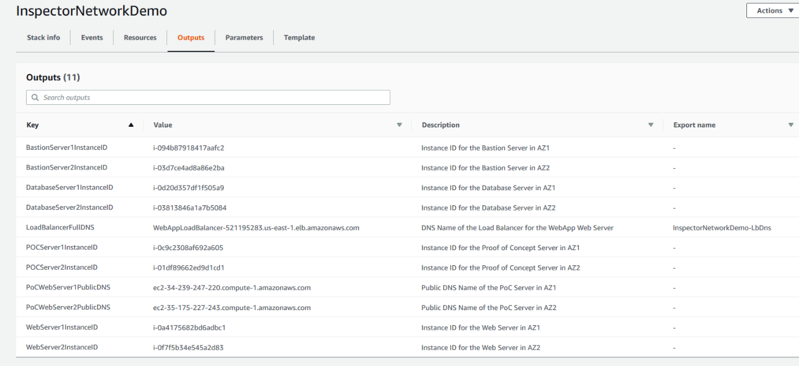
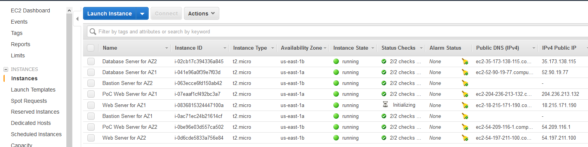
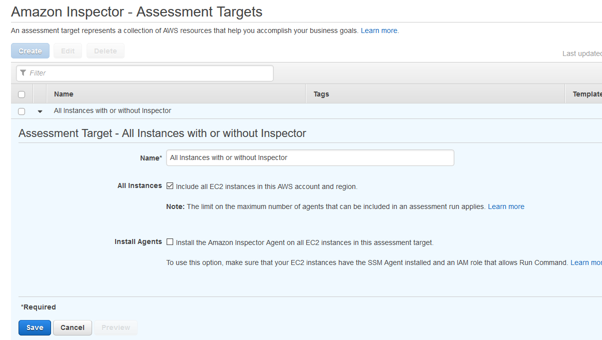
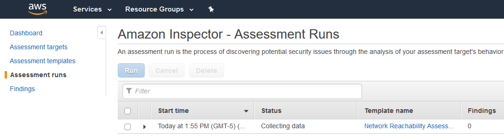

Module 2 - Running the Inspector Report
=======================================

In the previous module you created the workshop's environment including EC2 instances running various applications. In this module you will gather the information from the CloudFormation Stack and use it to validate those services are running and run an Inspector Network Reachability report.

Running the Inspector Report
============================

1.  Refresh the CloudFormation interface until the Status shows “Create Complete”

	

2.  Click on the Stack Name

3.  Go to the Outputs tab of the Stack

	

4.  Copy the DNS names from the Output frame into a text editor window. You can use these to validate the Web servers that should be publically accessible are.

    1.  The LoadBalancerFullDNS and PoCWebServer1PublicDNS should work.

    2.  PoCWebServer2PublicDNS should time out.

5.  Copy the instance ID’s from the Output frame into a text editor window. These will help you when you review the Inspector report.

6.  Go to the EC2 console to validate the instances are running.

	

7.  Go to the Inspector console.

	Next you will create the Amazon Inspector Targets and Templates. This workshop makes you do this manually to get a feel for how it works, but this can be automated.

	First, you create the Assessment Target to include all instances, even those without the agent.

	

	!!! info "If you have not used Inspector in this region before"
		You will get a different set of screens. Start by clicking a.) “Getting Started” on the Inspector page, and then b.) “Advanced Setup” on the bottom right to get to the Assessment Target screen – Step 10

8.  Click on Assessment Targets. Your window should be similar to the image below.

	

9.  Click “Create”

10.  Fill out the screen as follows:

    1.  Name: {Whatever name you will remember}

    2.  All Instances: Uncheck the box

    3.  Use Tags

        1.  Key: NetworkReachabilityDemo

        2.  Value: True

    4.  Install Agents: Uncheck the box

	

	!!! info "Service Linked Role"
		Inspector may prompt you for permission to create a Service Linked role to give the Inspector service permission to do work on your behalf.  Click OK.

11.	Click “Save”

	!!! info "If you have not used Inspector in this region before"
	You should click "Next" to get to the Assessment Template screen – Step 14

12.	Click on Assessment Templates

13.	Click on “Create”
	
	

14.	Fill out the screen as follows:

    1.  Name: {Whatever name you will remember}

    2.  Target Name: {The Assessment Target you just created} - This is only required if you have already used Inspector in this region before. Otherwise this is enabled by default.

    3.  Rules packages: Select ONLY “Network Reachability-1.1”

    4.  Duration: “15 minutes”

    5.  Assessment Schedule: Uncheck the box

15.	Click the button labelled “Create” or “Create and run”

16.	Click on Assessment Runs and then the refresh icon. Your window should be similar to the image below.

	

17.	The status should say “Analyzing” or “Collecting data”

	You are now going to publish the report to an SNS topic so you can take action. An SNS topic has been created for you in the CloudFormation Template.

18.	Click on Assessment templates

19.	Click on the right arrow next to the Assessment your created to expand the options.

20.	Click on box under "SNS topics"

21.	Click the drop down and select the Topic named {Accountnumber}:InspectorAutomation

22.	Deselect all of the events EXCEPT "Findings Reported".

23.	Click Save

You have successfully configured Inspector and started an assessment. This assessment can take up to 15 minutes, so now’s a good time for you to review the architecture. The [Presentation](./assets/demo-support-presentation.pdf) includes the architecture diagram, the route tables, and the security groups. The [Presentation Notes](presentation-notes.md) page then walks through the architecture with some probing questions.

You can also choose to skip to [Evaluating Findings](03-evaluate-findings.md) once the report is complete.