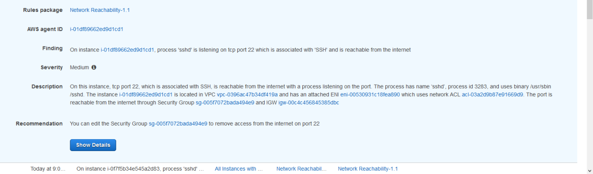

Module 3 - Evaluating Findings
==============================

In the previous module you started the Inspector Assessment against all of the instances and network configurations you created in Module 1. In this module you will evaluate the various findings generated by the Inspector report and identify potential mitigations. You will use these findings to evaluate the assumptions discussed in the start of the workshop. For reference they are:

Assumption 1.\> Instances in private subnets are not accessible from the internet

Assumption 2.\> Putting servers in different Availability zones provides both failover and better reliability

Assumption 3.\> Nothing can route through the bastion VPC

Assumption 4.\> Access to the servers is limited according to the principle of least privilege

Assumption 5.\> The bastion hosts can access all environments

Evaluating the Inspector Report Findings
========================================

Let's look at the Inspector Network Reachability report findings and see what you can learn.

1.  Go back to the Inspector console and select Assessment Runs from the navigation. Your assessment should be marked "Analysis Complete".

	

2.  Click on “Findings”

	

	!!! info "Inspector Agent delay"
		If you see multiple Medium findings and none of the findings indicate the Inspector agent was running, you will need to delete the Assessment and run it again. This means the instances did not have the Inspector agent running at the time of the scan. The agent is installed, it may just have been coming active.

	To begin, you will start evaluating the higher severity findings. So let’s take a look at a Medium finding first.

3.  Expand the Medium finding by clicking the arrow to the left of “Medium”

	

	First, copy the ARN (Amazon Resource Name) that begins with "arn:" into a text editor window, you will need it later. You can see that a misconfigured Security Group is allowing access to an instance and the instance is listening on that port. So Assumption 4 was wrong. This is something the Security team would want addressed first.

	So since you know some things are wrong, let’s check the other findings for this server. You do that by filtering by the instance ID.

4.  Highlight the AWS agent ID, copy it, and scroll back to the top to paste the Instance ID of the offending instance in the “Filter”

	

	Hover over the finding titles with your mouse. You will immediately see multiple findings about Peered connections, one Low and the top three Informational findings. Since you already looked at the SSH finding and know you need to address that, let’s look at the Informational finding for this peered connection.

5.  Expand the “Finding” Column so you can see enough of the title to see “Peered”

6.  Expand the Informational finding that starts with “Aggregate network exposure” and has “Peered”

	

7.	Check what VPC is peered. Click on the VPC Peering Connection link in the finding to open it in a new window. Note the peer name.

8.	Click on the VPC peer name from the finding.

9.	Click on the Requester VPC in the bottom window.

	Here you see the peer is to the Bastion VPC. This is okay because you expect this behavior. What you don’t see, however, is anything about connectivity from the WebApp VPC. That’s because the report knows there’s no way to transit through multiple VPC Peering connections today. So this helps you validate Assumption 3 is true as long as there’s no additional routing the report can’t see (for example a Cisco CSR Transit VPC). But this also means Assumption 5 is false because there is no Peer between the Bastion VPC and the Proof of Concept.

	What about the multiple Availability Zone configuration though for this Proof of Concept? Given the misconfiguration, you should check Assumption 2. Since you want to check against multiple Instances, let’s filter by VPC, in this case the PoCVPC.

10.  Close the preview window and go back to the findings. Scroll back to the top and put the VPC ID of the offending instance in the “Filter”. Collapse the first finding you had open.

	

	Next, you want to compare the Internet reachability. The most relevant findings related to internet access are the “Aggregate network exposure” findings. Those are found half way down the list. Comparing them visually you will see one instance only has port 80 open. 

11.  Expand the first finding that starts with “Aggregate network exposure” and has “internet”.

	

12.  Notice only port 80 is open. Collapse this finding.

13.  Expand the second finding that starts with “Aggregate network exposure” and has “internet” – it will have a different instance ID.

	

	Here you see the other instance has ports 22 and 443 open.

	This would indicate than in a failover scenario the second instance would fail to respond to any HTTP traffic. So this must be fixed for failover to work. Assumption 2 is proven false.

	The remaining assumption, Assumption 1, related to the Private Subnets, so let's move on from the POC Server side. You have a couple of things you need to address so can send this report to the developer to have them fix things. Let’s start looking at the WebApp side. Notice the route table for the Database subnet is incorrect, so let’s see if that is having any security impact. Again you can filter by the instance ID, or something you expect to see in the finding. For example, let’s filter by the port number: 3306.

14.  Collapse the open findings. Scroll back to the top and put “3306” in the “Filter”

	

	Here you are looking for instances open to the internet on this port. One of the first findings indicate the instance has ports are reachable from the internet.

15.  Expand the finding that starts with “Aggregate network exposure” and has “internet”

	

	From the naming context you know this is wrong since this instance shouldn't have access from the internet. But rather than following this one recommendation, you can also to apply a different route table to the subnet. This just shows how there are different ways to solve the same problem, but it requires context. This is a good example where defense in depth is important. You may have set the Security Group to 0.0.0.0/0 for testing or internal access purposes, but because of a bad assumption you potentially put your entire environment at risk.

	In the end this proves Assumption 1 was false and needs to be revisited for all servers.

!!! info "Alternative methods of analysis"
		There’s another way to compare instance findings like this. You can download all of these findings in a .csv file, allowing you to sort, filter, and compare much more programmatically. We choose not to do this to provide a consistent experience for all participants.

Take Aways
=========

Thanks to the Network Reachability report you were able to validate one assumption but prove that 80% of our assumptions had problems due to misconfigurations. The Network Reachability report gives you confidence in understanding which instances could talk to whom, and in a consistently reportable, auditable manner. This is the power of Amazon Inspector.

But now what? You don't want to leave these issues as they are, so let's see how to automatically remediate them by combining other AWS tools and services. [Integration and Remediation](04-integration-and-remediation.md) will do just that.
